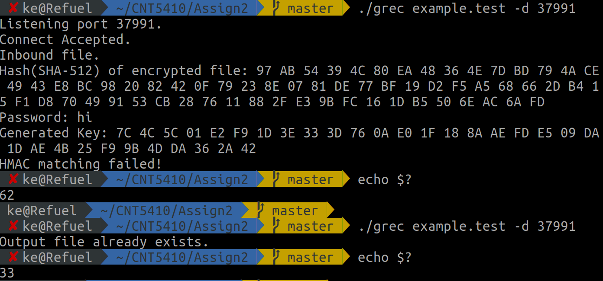

# CNT5410 Assignment 2

### Author & Environment

> Author:           Ke Chen 8431-0979
> Environment:      gcc version 7.4.0 (Ubuntu 7.4.0-1ubuntu1~18.04.1)

### Introduction

The program is using OpenSSL to encrypt a test file and send the file to the target IP:port. The IV is generated randomly so need to be sent with the encrypted file(so I didn't check the HMAC of the IV part since it should be transfered individually). The structure of the encrypted file will be (IV||ciphertext||HMAC).

### Running results

1. Show the hash(SHA-512) result of the test file.

```
Hash(SHA-512) of plaintext: 5D CA 14 ED A9 7E C9 9B 0F B2 C4 76 0D 81 7C 21 A8 84 5F 9D 40 51 9C 35 46 0D AA 5D 59 4A 13 FD 76 C0 00 30 66 FE C9 33 E3 0E EA EB 66 7D F6 3E D7 90 D2 84 AA 80 A4 2F FD 64 DA 14 D8 4F 74 33 
```

2. key derived from PBKDF2.

```
Password: hello
Generated Key: 42 DA EE F1 85 A1 E9 EA 4B D8 8E 86 F8 DC 72 F1 30 B3 86 1F 5B 26 F2 1F C7 B9 75 67 21 C6 D6 06 
```

3. SHA-512 of the ciphertext(without IA).

```
Hash(SHA-512) of encrypted file: 58 43 FA 34 B2 06 BB 5F 45 99 51 24 28 7B 81 CB 6C 91 F7 25 40 0F 16 24 14 31 54 DA A1 24 F1 CC 9F 41 0C 2D C8 9E EE BC BE ED 65 E0 27 B4 BC 23 75 88 63 B8 3E 58 81 1E 57 0A 46 22 4A C8 AA F0
```

4. SHA-512 of the outputfile of gsend and the data send through the network(IA||ciphertext||HMAC), won't be the same every time since IA is randomly generated.

```
Hash(SHA-512) of encrypted file||HMAC: 66 57 8A 8C A4 01 83 DD 19 3C E5 41 16 8F 45 A0 3F 22 D6 19 BE BC EB 0D 36 C6 3E B0 1E 76 28 4B A5 7F 8C CE A7 90 BF B9 24 C6 02 95 46 6C 9E 0D F8 F7 F8 B9 BD 7F 7E 77 D1 5D AE 5B BC B6 93 53
```

5. SHA-512 of the inbound file(same as the encrypted file)

```
Inbound file.
Hash(SHA-512) of encrypted file: 66 57 8A 8C A4 01 83 DD 19 3C E5 41 16 8F 45 A0 3F 22 D6 19 BE BC EB 0D 36 C6 3E B0 1E 76 28 4B A5 7F 8C CE A7 90 BF B9 24 C6 02 95 46 6C 9E 0D F8 F7 F8 B9 BD 7F 7E 77 D1 5D AE 5B BC B6 93 53 
```

6. HMAC Checking and error codes(showing when failed)

```
Password: hi
Generated Key: 7C 4C 5C 01 E2 F9 1D 3E 33 3D 76 0A E0 1F 18 8A AE FD E5 09 DA 1D AE 4B 25 F9 9B 4D DA 36 2A 42 
HMAC matching failed!

echo $?
62
```

7. Error code when file already exists.

```
Output file already exists.

echo $?
33
```

8. When try to modify last few bytes of the encrypted file, the receiver will get the wrong HMAC, so it will output HMAC matching failed.


### Screenshots


