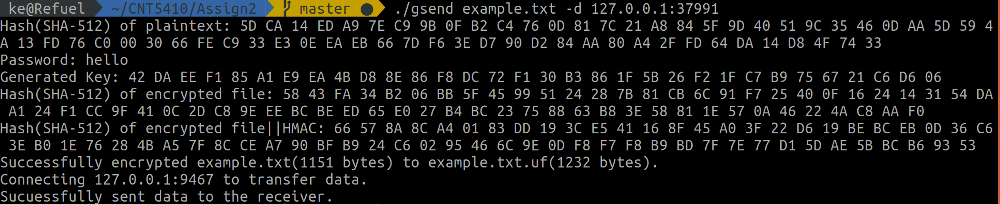
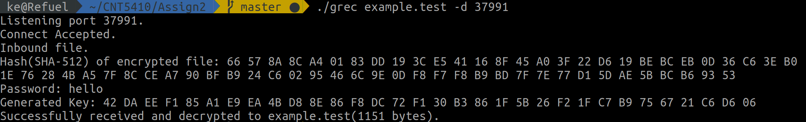
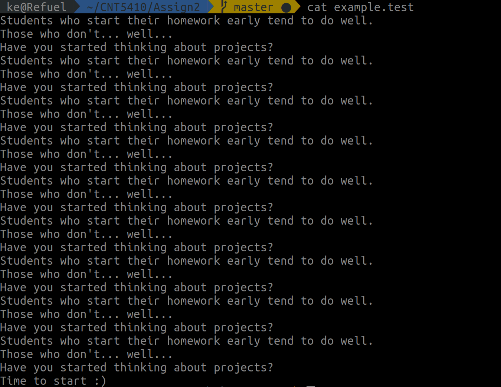

# CNT5410 Assignment 2

### Author & Environment

> Author:           Ke Chen 8431-0979
> Environment:      gcc version 7.4.0 (Ubuntu 7.4.0-1ubuntu1~18.04.1)

### Introduction

The program is using OpenSSL to encrypt a test file and send the file to the target IP:port. The IV is generated randomly and sent with the encrypted file. The structure of the encrypted file will be IV|ciphertext|HMAC.

### Running results

1. Show the hash(SHA-512) result of the test file.

2. 

### Screenshots

